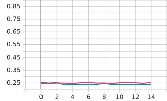
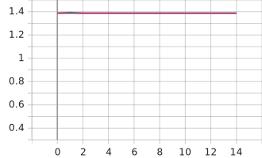
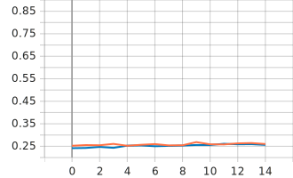
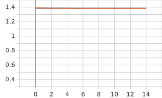
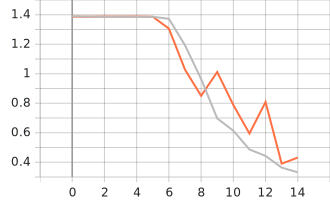
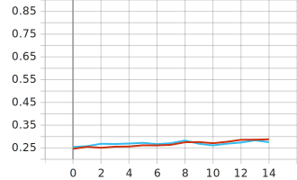
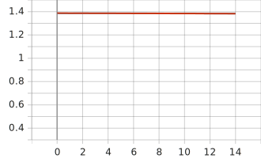
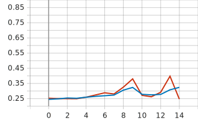
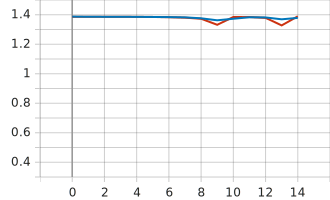
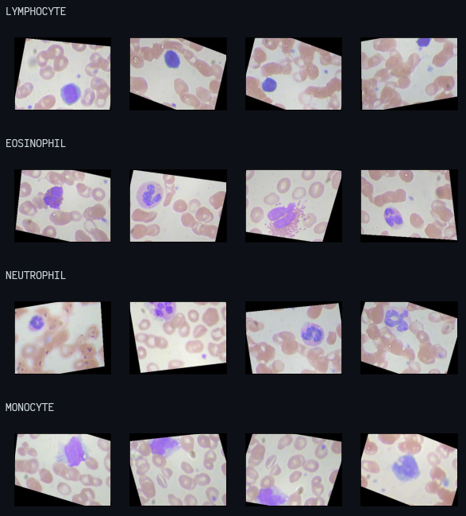

# BLOOD DISEASE DETECTION

**GOAL**
To make a CNN to classify different type of blood disease.
 

**DATASET**
https://www.kaggle.com/datasets/paultimothymooney/blood-cells
 

**DESCRIPTION**
This dataset contains 12,500 (320x240 rgb) augmented images of blood cells (JPEG) with accompanying cell type labels (CSV). There are approximately 3,000 images for each of 4 different cell types grouped into 4 different folders (according to cell type). The cell types are Eosinophil, Lymphocyte, Monocyte, and Neutrophil.

There are 2 folders namely dataset-master and dataset2-master. dataset-master contains the original (with no augmentation) 410 images of the different cell types. Where as the dataset2-master contains 3000 augmented images for each cell types, with different folders for training, testing and validation (test_simple).
 

**WHAT I HAD DONE**
I have created an input pipeline using `tf.keras.utils.image_dataset_from_directory`. It eases the process of creating traing, testing and validation datasets with the use of a simple folder structure. More on it [image_dataset_from_directory](https://www.tensorflow.org/api_docs/python/tf/keras/utils/image_dataset_from_directory).

Then the datasets are passed to the model for training. The CNN consists of 4 `2D Convolution` and `Pooling` layers, and a single Dense
 

**MODELS USED**
List out all the algorithms or models used in this project Why have you choosed that algorithms should also be stated
Summary of the model -

The model is trained with various parameter combinations.

 `Training`
 `Validation`

| OPTIMIZER |          LOSS FUNCTION          | ACTIVATION FUNCTION |                    
ACCURACY
           |         
LOSS
                                 |                                        Link                                       |
|:---------:|:-------------------------------:|:-------------------:|:--------------------------------------------------------------------:|----------------------------------------------------------------------|:---------------------------------------------------------------------------------:|
| adam      | sparse categorical crossentropy | relu                |                     |                             | [TensorBoard](https://tensorboard.dev/experiment/dlF6LYCxTn2kYA2SVCXZFw)          |
| adadelta  | sparse categorical crossentropy | relu                |                 |                         | [TensorBoard](https://tensorboard.dev/experiment/oKYQnvs2RmOOqBWR4V6gsA)          |
| rmsprop   | sparse categorical crossentropy | relu                |                  |                          | [TensorBoard](https://tensorboard.dev/experiment/631Uyt1gR7aL4udZYT8QlA)          |
| adagrad   | sparse categorical crossentropy | relu                |                  |                          | [TensorBoard](https://tensorboard.dev/experiment/Oibh7HgJR4KbJasGY5i96g)          |
| sgd       | sparse categorical crossentropy | relu                |                      |                              | [TensorBoard](https://tensorboard.dev/experiment/J4v0y5gpRn2ZgNrlV9alGA)          |
 

**LIBRARIES NEEDED**
matplotlib == 3.5.1
numpy == 1.22.3
Pillow == 9.2.0
protobuf == 4.21.5
tensorboard == 2.9.1
tensorflow == 2.9.1
 

**VISUALIZATION**
Differnet Cell types

**CONCLUSION**
Based on the optimizer used we get different accuracies for the same model. Some optimizers for example SGD (Stochastic Gradient Descent) because of a slower convergance need more epochs to reach the minimum when compared to optimizers like RMSPROP (Root Mean Squared Propagation).

# Uttkarsh Patel

Connect with me on Linkedin: https://www.linkedin.com/in/uttkarsh-patel-62b011218/

Check out my Github profile: https://github.com/Uttkarsh09
